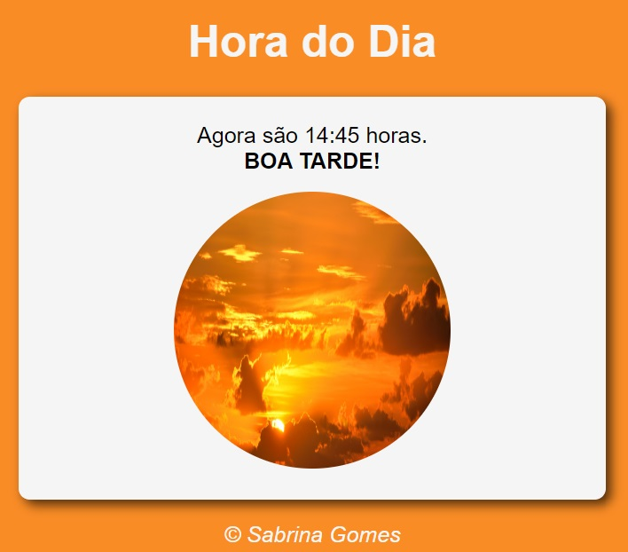
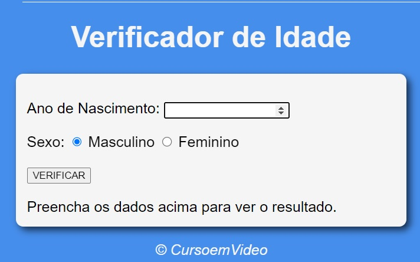
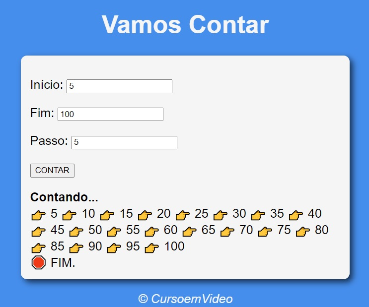
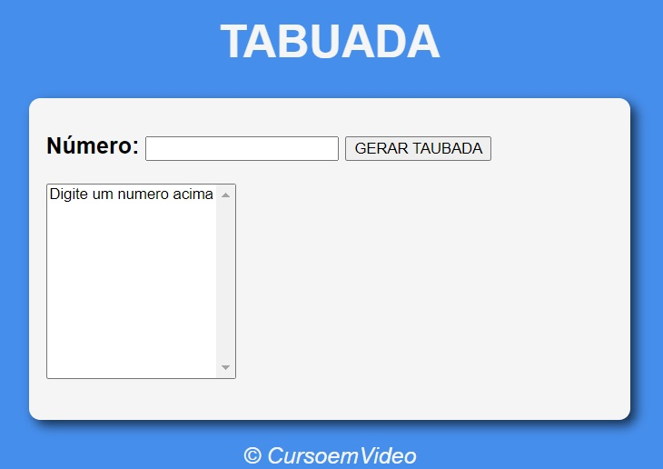
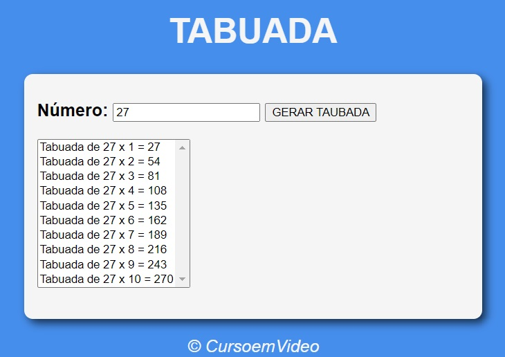
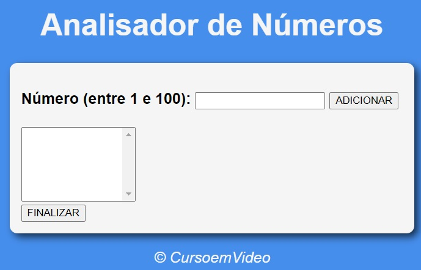
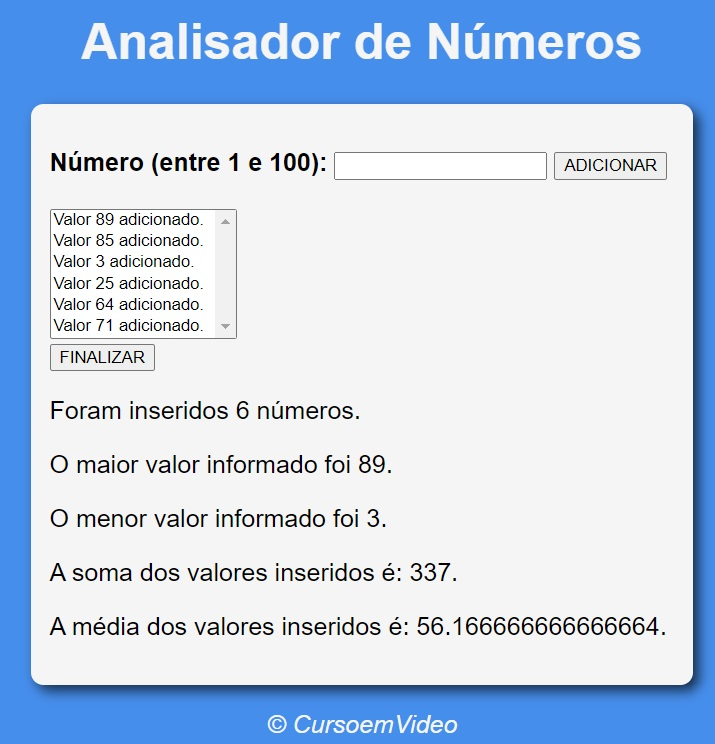

# Curso de JavaScript - Curso em Video (Gustavo Guanabara)

## 📖 Sobre

Dividido em MÓDULOS de A até F com 17 aulas ao todo + 8 aulas somente para exercícios. O curso apresenta o básico de JavaScript, passando por:

- [x] Comando Básicos;
- [x] Tratamento de Dados;
- [x] Operadores;
- [x] Introdução ao DOM / Eventos DOM;
- [x] Condições;
- [x] Repetições;
- [x] Variáveis Compostas.
 
 📌 Curso disponível no [youtube](https://www.youtube.com/playlist?list=PLHz_AreHm4dlsK3Nr9GVvXCbpQyHQl1o1).

 📝 [Notas criadas durante o curso.](.github/NOTAS-gb-javascript-iniciante.txt)

## 💡 Exercicios desenvolvidos

### Exercício 01 - Hora do Dia.
 → Exibe imagens e cores de acordo com o horário do dia.

  

### Exercício 02 - Verificador de idade.
 → Exibe resultado com imagem variada de acordo com as informações recebidas do usuário (ano nascimento e sexo).

  
  
  

### Exercício 03 - Contador.
 → Exibe contagem de números de acordo com os parametros recebidos pelo usuário. Inclui algumas validações como: alerta para campos vazios e altera valor do "passo" para 1, caso o usuário informe 0 ou número negativo.

  

### Exercício 04 - Tabuada.
 → Exibe a tabuada do número informado pelo usuário.

  
  

### Exercício 05 - Analisador de Números.
 → Realiza analise dos números informados pelos usuários. Validações: gera alertas para números fora do parametro solicitado (1 a 100) e para números já incluídos.

 

  
  

## 💻 Feito com

Feito por <a href="https://github.com/sabrinagomesb">💫 Sabrina Gomes</a>

